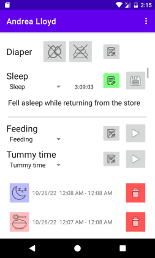

# Development temporarily on hold due to my move to a new house

Dear visitor. I was hoping to be able to resume development of the app further a bit sooner. However, I am still not finished with moving into my new place. Because this entire app is kept afloat as a hobby project next to my 9-5 job, I have to officially declare that development is on hold until my move is finished. Most importantly my PC has to move to its final location and I need to unpack my Android testing devices.

I expect development and updates to start again in the Winter 2025. Until then the app will only get attention if when it breaks. Thanks for anyone purchasing the app on the play store. It is really exciting and encouraging to me to have built something that seemingly is useful for others!

# Baby Buddy for Android

Android integration for the open source web-app
[Baby Buddy](https://docs.baby-buddy.net/)
([Source](https://github.com/babybuddy/babybuddy)), which is optimized for
_quick_ timer starting and stopping and diaper logging for easier logging
while handling children.

## Where to get?

You can either install the [APK from the lastest release](https://github.com/babybuddy/babybuddy-for-android/releases/latest) directly or buy the app on the Google Play store:

(The second and third options offer automatic updates and support the app's development)

## User Documentation

[User documentation](doc/index.md) is available as part of this repository and
in the app as a slide show.

## Build instructions

**Warning**: This repository uses _nonfree_ third-part resources. Redistribution
requires attribution of the original authors. See "Licenses" section for details.

Building this project requires a relatively complex series of build
dependencies. There is a shell script `check-build-prerequisites.sh` that you
can execute, which verifies if all build dependencies are met. However, here
a manual list of software packages that need to be available in the build
environment:

- bash + coreutils
- curl
- GNU make
- gcc/g++ for building python packages (only sometimes, depends on the architecture)
- jq (JSON query tool)
- ImageMagick
  - Specifically the commands: convert, composite
- pandoc >= 3.1.1
- Python3 >=3.8: Used for transforming and downloading resource files for the application
  - Python packages, can be installed using `pip`: pipenv, cython
- JDK 17, the environment variable `JAVA_HOME` needs to point to the install path
- Android SDK with Android NDK installed. The environment variable `ANDROID_HOME`
    needs to poin to the Android SDK install path

Next, make sure that you cloned the repository _recursively_:

~~~~~~.sh
$ git submodule update --init --recursive
~~~~~~

This will make sure that the zxing library is downloaded, ready to be built
alongside babybuddy-for-android.

Now check if the build-environment is ready. It should produce output as follows:

~~~~~~.sh
$ bash check-build-prerequisites.sh
== Checking build tools ==
Check if GNU make is installed...
Check if curl is installed...
Check if image magick is installed...
Check if python3, cython, and pipenv are installed...
Check if jq is installed...
Check if java 18.* is installed and accessible via JAVA_HOME...
Verify if ANDROID_HOME is set and contains the android sdk we need...
Reading targetSdk value from app/build.gradle...
Check if Android NDK is installed...
== Checking build dependencies ==
Check if zxing is downloaded...
== All required build tools and dependencies are installed ==
~~~~~~

Next, you can use the default set of gradlew-commands to build the project
as needed. However, when running things merely from the console, it is unlikely
that you have an android emulator running to run the full test suite. The
android emulator is needed for some integration tests that interface with the
android system libraries. To run a build without running integration tests, use:

~~~~~~~~.sh
./gradlew build -PskipIntegrationTests
~~~~~~~~

Hope that this all works for you, happy building!

## Licenses

The software (code) is made available under the MIT License.
See [LICENSE.md](LICENSE.md) for details.

In addition, this software contains _media_ published under
non-free attribution licenses. Please see
[the attributions page](ATTRIBUTIONS.md) for details where
third party media was sourced and the corresponding license.
