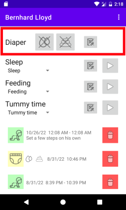
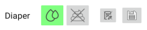

# Logging diaper changes

The quick buttons for logging diaper changes can be found in the upper part
of the app.

The buttons are designed to be able to _quickly_ register a diaper change at
that happened at the current moment. The two icons indicate how "wet"
and "solid" contents. Click one or both as observed, and a save-incon will
appear.

Press the save button to record a diaper change. That is it, easy as that.