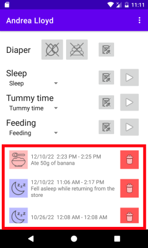

# Event history

The bottom section of each child shows a list of the most recent caregiver events that were logged for a child.

Each event is logged in reverse chronological order. You can scroll downwards through the list which will reveal more events from the past.

You can use the red delete button next to a history entry to remove it:

In addition, you can long-click any of the items. This will open the corresponding page on the Baby Buddy webapp in your browser, allowing more sophisticated ways of editing a history entry.
