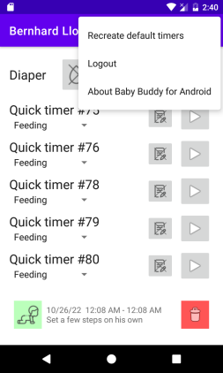

# Setup for time logging

The time logging feature uses Baby Buddy's timer feature so that multiple caregivers can stop the same set of timers. In the simplest case, you have a child that has no registered timers configured. In this case, the app will present you with the option to "create default timers":

When clicking the button, the app will automatically create a set of timers on the server for you with default names corresponding to the three main activities that can be
logged on Baby Buddy:

- Tummy time
- Sleep
- Feeding

That will look like this:

The advantage of using the default timers is that they - by default - should work for anyone using the Android app. However, it is not necessary to use default timers. All timers configured for a particular child will be shown in the timer list.

In particular when linking a Baby Buddy instance that was used before, a set of stopped (Quick-)timers might already be present:

In this case you can use the "recreate default timers" option from the menu in the top-right of the application to relplace all already created timers are replace them with the default set.

# Using timers

First, you should associate existing timers with the corresponding type of activity that should be tracked for that given timer. When using the app's default timers, this is not necessary, because one timer for each activity will be created by default.

However, for timers that were note created by the app you can select the timer type in the drop-down below the Timer-name:

The timer will be associated with that particular type of activity. Note that this is different from how Baby Buddy manages the timers! When stopping a timer the the associated activity will be logged automatically.

# Logging different activities

Logging "Tummy time" and "Sleep" time is simple: Start the timer, stop the timer and the activity is logged.

Logging a feed is more complex: When the timer is stopped, a new screen opens allowing you to log more details about the feeding session that should be logged.

The top shows a horizontal slider that can be used to adjust the "amount"-value. The amount value is a generic number that will be associated with the feeding and could, for example, be the weight of the meal that the child consumed. Scrolling to the very left allows a "None"-option in case no "amount" should be registered.

Below the amount-slider an optional field for notes is shown.

Below the notes field there are buttons that allow you to store the type of feeding that needs to be registered. The screen will guide you through the different required fields. When everything has been set, you press the "Save" button to save the feeding entry to the Baby Buddy.

