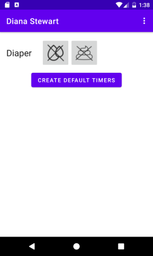
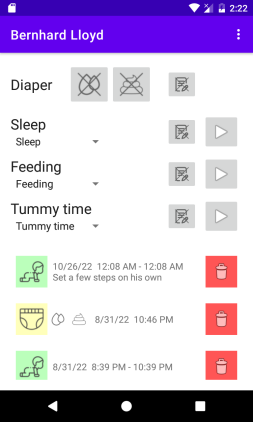
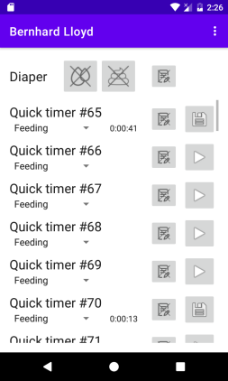
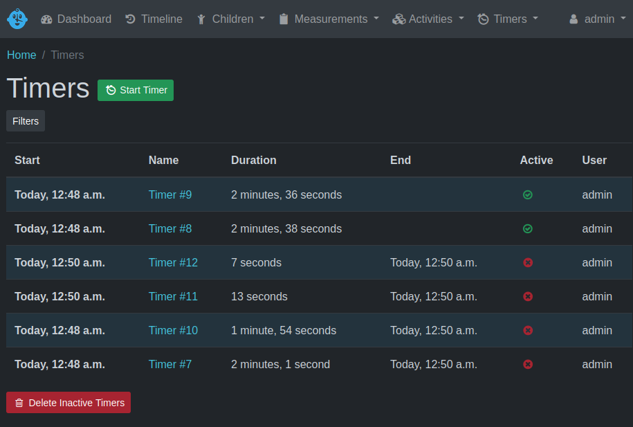
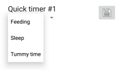
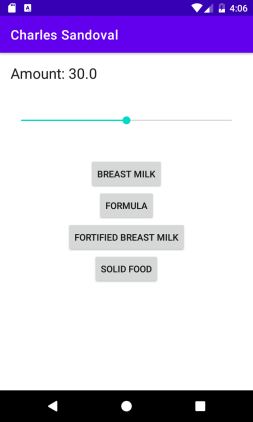
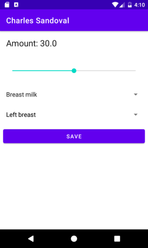

# Setup for time logging

The time logging feature is a little complex because it needs to be
synchronized with Baby Buddy's timer feature so that multiple users can
stop the same set of timers. In the simplest case, you have
a child that has no registered timers configured. In this case, the app will
present you with the option to "create default timers":

When clicking the button, the app will create a set of timers on the server
with default names corresponding to the three main activities that can be
logged on Baby Buddy:

- Tummy time
- Sleep
- Feeding

That will look like this:

The advantage of using the default timers is that they - by default - should
work for anyone using the Android app. However, it is not necessary to use
default timers. All timers configured for a particular child will be shown in
the timer list.

In particular when linking a Baby Buddy instance that was used
before, a set of stopped (Quick-)timers might already be present:

I would advise to clean those before using the Android app from the timers menu
in Baby Buddy:

# Using timers

First, you should associate existing typers with the corresponding type of
activity that should be tracked for that given timer. When using the default
timers (see above), this is not necessary, because one timer for each activity
will be created by default.

However, for pre-configured other timers with you can select the timer type 
in the drop-down below the Timer-name:

The timer will be associated with that particular type. Note that this is
different from how Baby Buddy manages the timers! When stopping a timer the
the associated activity will be logged automatically.

# Logging different activities

Logging "Tummy time" and "Sleep" time is simple: Start the timer, stop the timer
and the activity is logged.

Logging a feed is more complex: When the timer is stopped, a new screen opens
allowing you to log more details about the feeding that should be logged.

(This will be subject to change so I will only briefly explain the screen)

The slider at the top allows you to select the "amount" that the child has 
consumed. Slide the slider and keep it pressed(!) to incrementally change the
amount.

Then select what type of feeding happened using the buttons below. The screen
will guite you through the different required fields. When everything has been
set, you press the "Save" button to save the feeding entry to the Baby Buddy.

