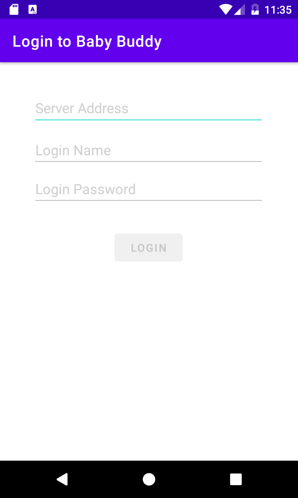
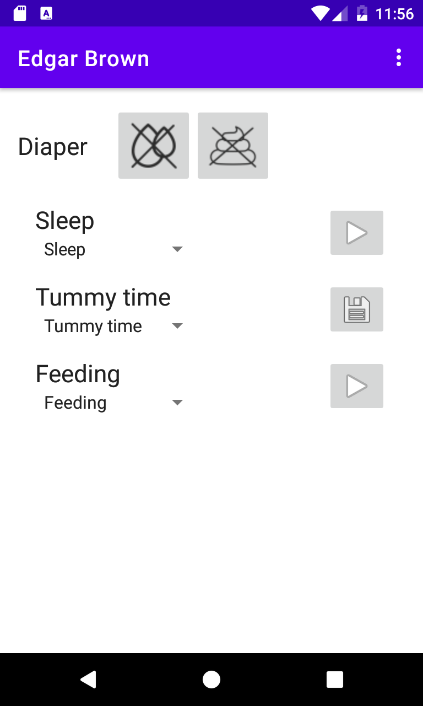

# Login and setup

When you first lauch the application you will be presented with the
login screen:

Enter the URL to the Baby Buddy server you want to use the app with in the
server-address bar. Then add your login name and password and press "login".

_Tip:_ You can try out the app with Baby Buddy's official demo server. Do not
put any private information into the app while logged in to the server! The
credentials for the server are:

- Server: http://demo.baby-buddy.net/
- Login Name: admin
- Login Password: admin
- Note: The server is _not_ using HTTPS so you need to deal with the HTTP 
    warning described below.

## Insecure HTTP connections

You _can_ use an insecure HTTP server to connect to but a warning will popup
advising you against it. It is strongly advised to only use HTTPS-secured
servers when logging in over the internet! Your password will not be encrypted
when logging in to a server over the internet using HTTP and can therefore
easily be stolen. The HTTP-option really only is there for _local_ installations
of Baby Buddy in a home network which is not exposed to the internet.

# Chidlren list

After you logged in to the server you should find the app showing information
for a single child in the Baby Buddy database:

You can swipe left and right to switch between multiple children.

If you did not create a child on the Baby Buddy webapp, yet, you will see
"(No children found)" in the title-bar of the app instead. Login to the
web app directly and add children as needed. After you created the children
you need, login back to the Android app and continue.

# Next steps

The app is optimized to make it easier to track times with Baby Buddy and
diaper changes. For details on these topics check the documents

- [Logging Diaper Changes](./diaper.md)
- [Logging times](./logging.md)
