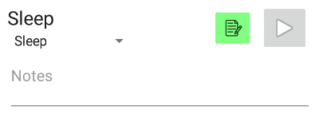

# Recording notes for timer items

Timers and diaper change buttons have a notes butten next to them to edit notes
that should accompany a logged time.

Pressing the button will unfolf a text-editor that allows one to take notes
for the corresponding diaper change or timer:

Notes will be _persisted locally on the Android device_ until the timer is
logged. Keep that in mind to not loose data. After a timer is stopped, the notes
are cleared. If you change your mind, and do not want to store taken notes
with your timer, press the notes-button again. Notes will be presisted locally
but when stopping the timer they will not stored with the logged event.
