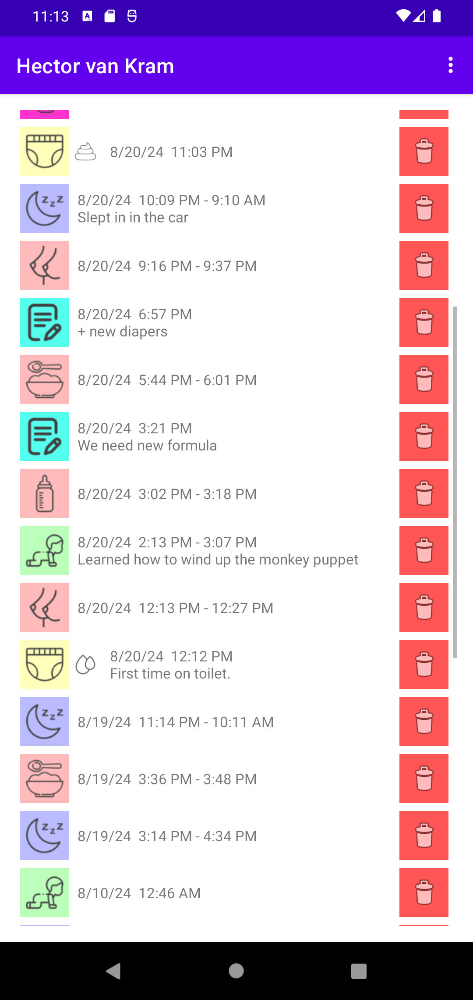

# Logging in

## Login

Wenn Sie sich mit Ihrem Babybuddy-Server verbinden möchten, haben Sie zwei Möglichkeiten: Entweder Sie geben die URL Ihres Servers, den Benutzernamen und das Passwort ein und drücken Sie dann auf "Anmelden", oder Sie wählen die QR-Code-Option (nach unten scrollen für mehr Details).

## QR Code login

Um sich mit einem QR-Code anzumelden, melden Sie sich zunächst auf Ihrem Babybuddy-Server mit einem anderen Gerät an. Danach besuchen Sie die Seite "Ein Gerät hinzufügen" und scannen Sie den QR-Code mit der App auf Ihrem Telefon. Wenn der Scan erfolgreich war, können Sie sich mit der App bei Babybuddy anmelden.

## Unsicherer Login

Wenn Sie eine http-Adresse anstelle einer HTTPS-Adresse verwenden, wird die App eine Warnung anzeigen. Bitte verwenden Sie HTTP Anmeldungen nur für lokale installationen von BabyBuddy-Servern in Ihrem eigenen Netzwerk.

## Home Assistant Ingress

Babybuddy für Android hat teilweise Unterstützung für die Anmeldung bei einem Babybuddy-Server, der auf einem Homeassistant-Ingress-Server gehostet wird. Hierfür muss Sie die QR-Code-Anmeldungs-Option verwendet werden.

# Übersicht

## Übersicht

Nachdem Sie sich angemeldet haben, sehen Sie Schaltflächen zur Aktivitätsprotokollierung am oberen Rand des Bildschirms und eine Ereignisliste kürzlich gespeicherten Aktivitäten darunter. Wenn Sie Aktivitäten für mehrere Kinder protokollieren, können Sie zwischen den Kindern wechseln, indem Sie den Bildschirm nach rechts oder links blättern.

# Timer-Protokollierung

## Timer starten

Um einen Timer zu starten, drücken Sie eine der Timer-Ereignis-Schaltflächen oben auf dem Bildschirm.

## Timer protokollierung

Wenn Sie einen Timer gestartet haben, öffnet sich eine Bedienfläche zum Eintragen von Details für den gerade gestarteten Timer. Füllen Sie alle Informationen aus, die Sie protokollieren möchten. Sobald alle erforderlichen Felder ausgefüllt sind, erscheint ein Speichern-Button.

## Timer stoppen

Wenn der Speichern-Button erscheint, können Sie den Timer stoppen, indem Sie den Speichern-Button drücken. Alternativ können Sie auch erneut auf die Timer-Schaltfläche oben auf dem Bildschirm klicken, um den Timer zu abzubrechen und keine Aktivität zu speichern.

# Ereignisprotokollierung

## Windeln und Notizen

Neben Timer-Aktivitäten können Sie auch Ereignisse wie Windelwechsel und allgemeine Notizen speichern. Die Steuerelemente funktionieren genauso wie bei der Timer-Protokollierung, aber ohne die Timerfunktion.

# Ereignisgeschichte

## Ereignisgeschichte

In Ereignisgeschichte auf dem unteren Teil des Bildschirms werden die letzten Aktivitäten des gerade ausgewählten Kindes angezeigt. Sie können Einträge bearbeiten, indem Sie den Eintrag in der Geschichte für drei Sekunden drücken. Um einen Eintrag zu löschen, drücken Sie den roten "Löschen"-Button.