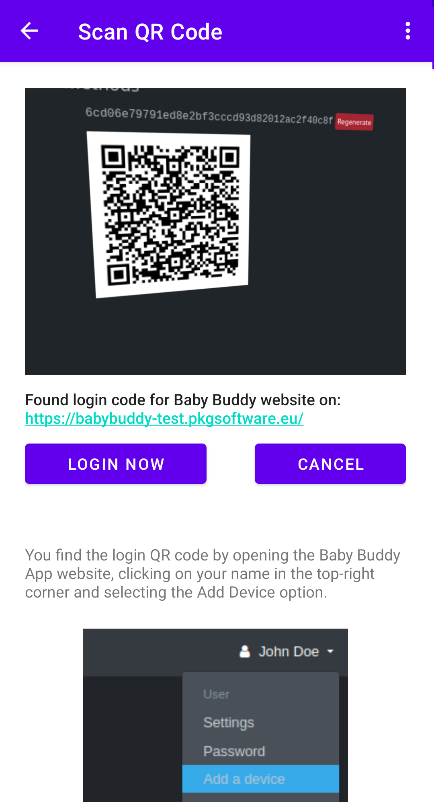
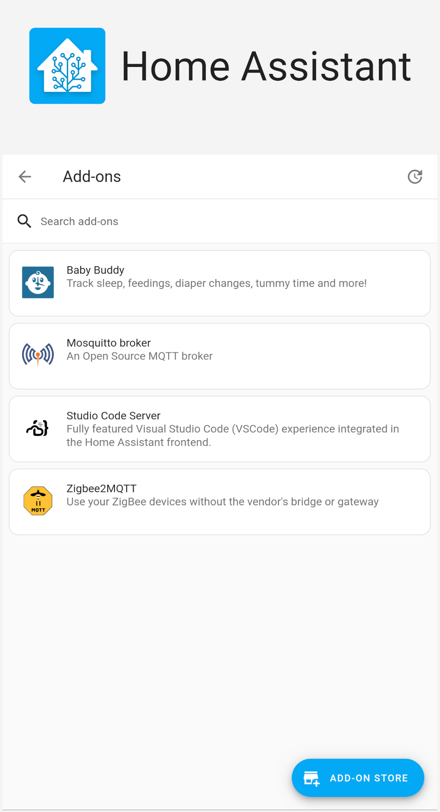
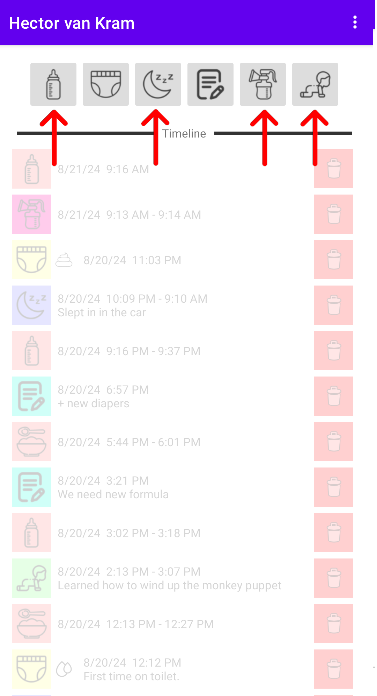
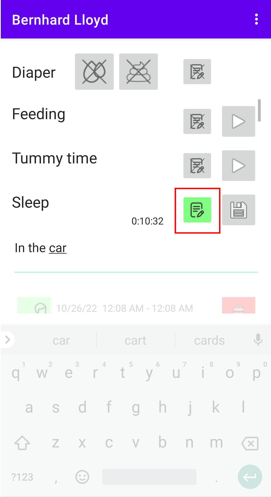
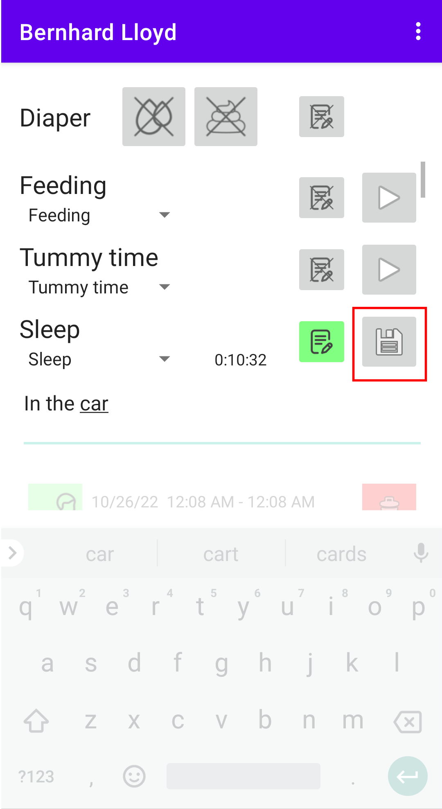
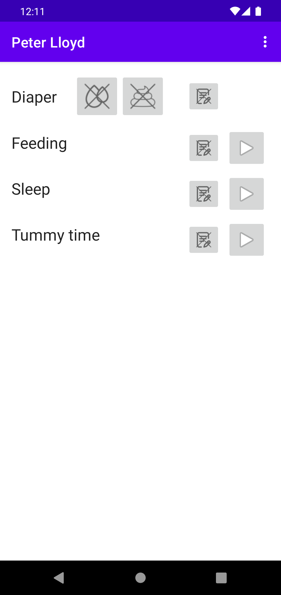
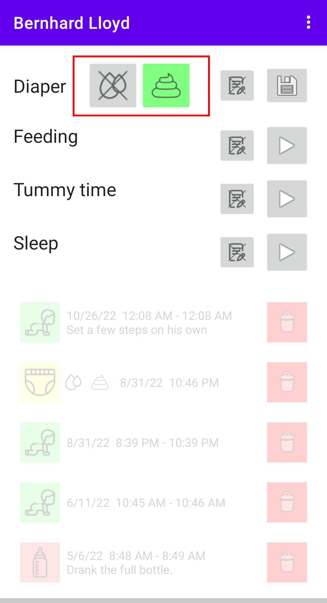
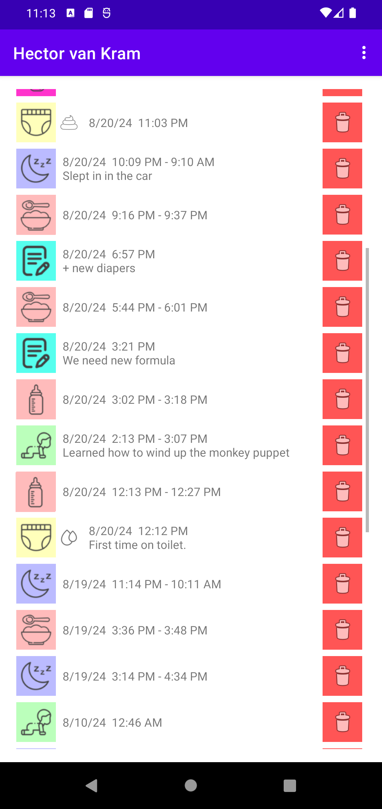

# Inloggen

## Login

Er zijn twee opties om verbinding te maken met uw Babybuddy-server:
Voer de URL, gebruikersnaam en wachtwoord van uw Babybuddy-server in. Druk vervolgens op
inloggen om de Babybuddy-app met de Babybuddy-server te verbinden. Of u kiest de
QR-codeoptie (scroll naar beneden voor details over die optie).

## Inloggen met QR Code

Als alternatief kunt u inloggen op uw Babybuddy-server met behulp van een inlog-QR-code. Log in
op uw Babybuddy-server vanaf een ander apparaat. Navigeer vervolgens
via het gebruikersmenu (rechtsboven) naar de pagina "Voeg een apparaat toe". Hier vindt u
de inlog-QR-code. Scan de QR-code met de app op uw telefoon. Als
de scan succesvol is, zou u de optie moeten krijgen om in te loggen op Babybuddy
door op de knop "Nu inloggen" te drukken.

## Onveilige login

Als u een http-adres gebruikt in plaats van een https-adres, zal de applicatie
u deze waarschuwing tonen. Gebruik deze functie alleen voor lokale BabyBuddy-servers in een
netwerk dat u beheert!

## Home Assistant Ingress

Babybuddy voor Android ondersteunt gedeeltelijk het inloggen
op een Babybuddy-server die gehost wordt op een Homeassistant Ingress-server. U
zult de QR-code inlogoptie moeten gebruiken om in te loggen op zo'n server.

# Overzicht

## Overzicht

Na het inloggen vindt u knoppen voor het registreren van activiteiten in het bovenste deel van het scherm
en een geschiedenis van recent geregistreerde activiteiten in het onderste deel van het scherm.
Als u activiteiten logt voor meerdere kinderen, kunt u horizontaal swipen om tussen kinderen te wisselen.

# Using Timers

## Using Timers

Druk op de "afspeelen"-knop om een timer te starten voor de vermelde activiteit.

## Using Timers

Terwijl de timer loopt, kunt u notities toevoegen door op de "notities"-knoppen te drukken.

## Using Timers

Om de timer te stoppen en de activiteit op te slaan, drukt u op de knop "opslaan".

## Feedings

Het opslaan van een voeding toont een tweede formulier, waar het type voeding (bijvoorbeeld vast voedsel) en de methode ingevoerd moeten worden voordat de voeding kan worden opgeslagen.

## Other timers

In een eerdere versie van Babybuddy voor Android toonde de app een willekeurig
aantal timers. Nu zijn standaard alleen timers voor de gebeurtenissen die kunnen worden gevolgd
door de app zichtbaar. Dit is veranderd om compatibiliteit te bereiken met
Baby Buddy versie 2.0.

# Verschoningen registreren

## Verschoningen registreren

De bovenste bedieningselementen maken het mogelijk om verschoningen te registreren. Selecteer het type luier en druk op de
"opslaan"-knop om de activiteit te registreren. U kunt optioneel notities toevoegen.

# Activiteitgeschiedenis

## Activiteitgeschiedenis

De geschiedenis onderaan het scherm toont de meest recente activiteiten van
het geselecteerde kind. U kunt invoeren bewerken door de invoer in de geschiedenis drie
seconden lang in te drukken. Dit opent de bijbehorende pagina in de BabyBuddy-app.
Om een invoer te verwijderen, drukt u op de rode "verwijder"-knop.
