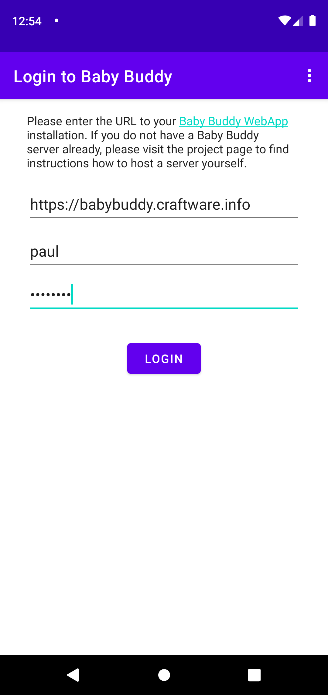
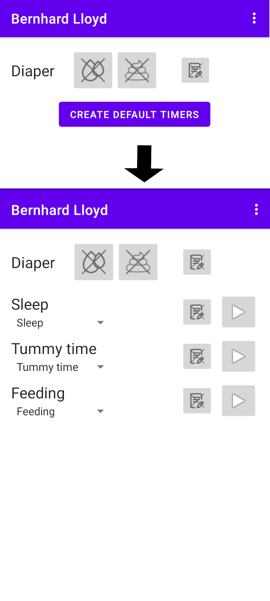
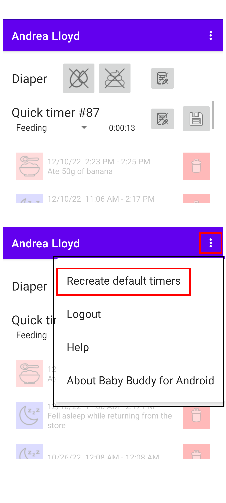
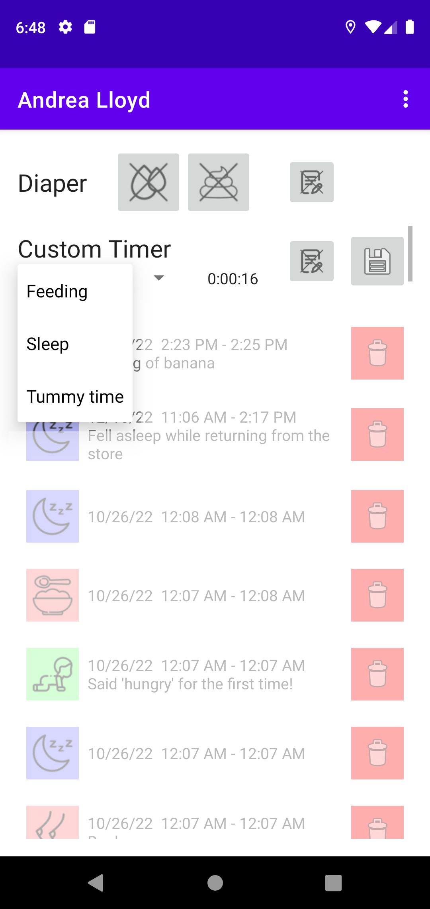

# Logging in

## Login

Enter your Babybuddy Server URL, username, and password. Then press login to connect
the Babybuddy App to the Babybuddy Server.

## Insecure Login

If you use an http-address instead of an https-address, the application will show you this warning. Only use this feature for local BabyBuddy servers in a network that you control!

# Create/manage Timers

## Default Timers

After logging in, the first thing you should do is setup the timers that you want to use.
Typically, you can click "Create Default Timers" to create timers for some primary activities
you might want to log.

## Timer Setup

If you started the app while timers were already running in your Baby Buddy app, this button
is not available. Instead, the pre-existing timers will appear on screen.
You can overwrite the current timers and (re-)create the default timers via the
"Recreate Default Timers" option from the menu.

## Configuring Timers

Alternatively, you can assign the timers to a (different) activity by using the drop-down menu.

# Overview

## Overview

After logging in, you find buttons for logging activities in the upper part of the screen
and a history of recently logged activities in the lower part of the screen.
If you log activities for multiple children, you can swipe horizontally to switch between children.

# Using Timers

## Using Timers

Press the "play"-button to start a timer for the listed activity.

## Using Timers

While the timer is running, you can add notes by pressing the "notes" buttons.

## Using Timers

To stop the timer and store the activity, press the "save" button.

## Feedings

Saving a feeding will trigger a second form, where the feeding type (e.g., solid food) and
method must be entered before the feeding can be stored.

# Logging Diapers

## Logging Diapers

The top controls allow logging of diaper changes. Select the type of diaper and press the
"save" button to log the activity. You can optionally add notes.

# Event history

## Event history

The history at the bottom of the screen shows the most recent activities of
the selected child. You can edit entries by pressing the entry in the history for three
seconds. This will open the corresponding page in the BabyBuddy app.
To delete an entry, press the red "delete" button.
