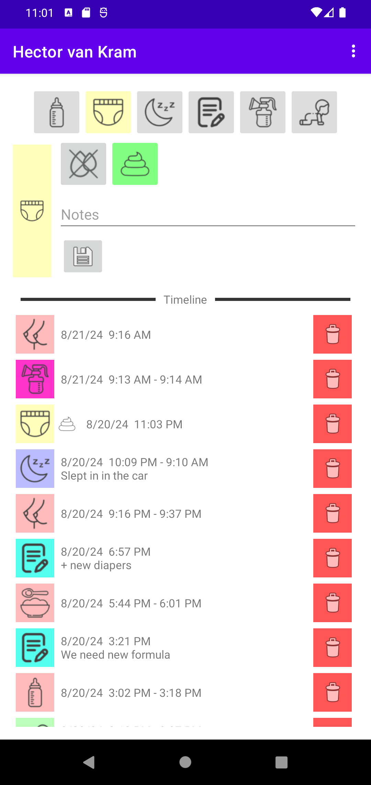

# Logging in

## Login

There are two options for connecting to your Babybuddy server:
Enter your Babybuddy server URL, username, and password. Then press
login to connect the Babybuddy app to the Babybuddy server. Or you choose the
QR Code option (scroll down for details on that option).

## QR Code login

Alternatively, you can login to your Babybuddy Server using a login QR-code. Login to
your Babybuddy Server from another device. Then navigate
via the user menu (top-right) to the "Add a device" page. This is where you find
the login QR-code. Scan the QR-code with the app on your phone. If
scanned successfully, you should get the option to login to Babybuddy
by pressing the "Login now" button.

## Insecure Login

If you use an http-address instead of an https-address, the application will
show you this warning. Only use this feature for local BabyBuddy servers in a
network that you control!

## Home Assistant Ingress

Babybuddy for Android has partial support for logging in
to a Babybuddy server that is hosted on a Homeassistant Ingress-server. You
will need to use the QR-code login option to login to such a server.

# Overview

## Overview

After logging in, you find buttons for logging activities in the upper part of the screen
and a history of recently logged activities in the lower part of the screen.
If you log activities for multiple children, you can swipe horizontally to switch between children.

# Using Timer Logging

## Using Timers

To start a timer, press any of the timer-event buttons in the upper part of the
application. This will start a timer.

## Using Timers

Starting a time will open an interface related to the timer that was just
started. Fill in all the information you want to log. Once all required fields
are entered a save-button will appear.

## Using Timers

Once the save-field appears, the timer can be stopped by pressing the 
save-button. You can also click the timer-button top-row again to cancel a timer
instead of saving it.

# Using Event Logging

## Logging Diapers and Notes

In addition to timer events the top-row allows logging of non-timer events, like
diaper changes and generic notes. The controls function the same way as for the
timer logging, but without a timer.

# Event history

## Event history

The history at the bottom of the screen shows the most recent activities of
the selected child. You can edit entries by pressing the entry in the history for three
seconds. This will open the corresponding page in the BabyBuddy app.
To delete an entry, press the red "delete" button.
